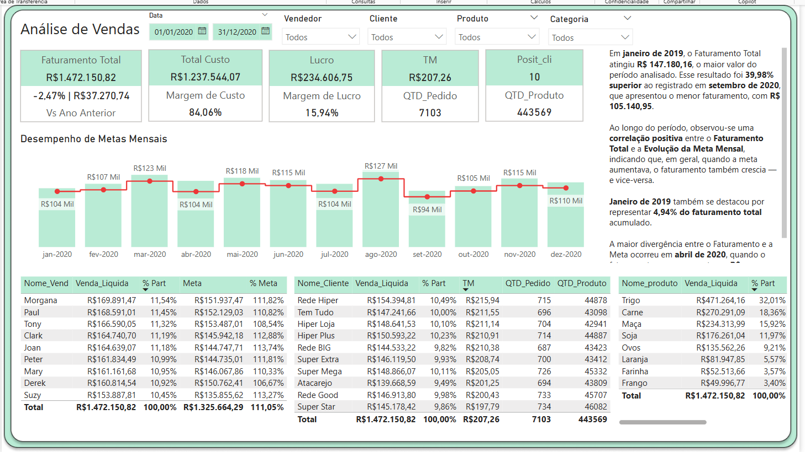

# 📊 Análise de Venda - Power BI

Este projeto apresenta uma análise de vendas desenvolvida no Power BI, com foco em insights estratégicos para tomada de decisão, acompanhamento de desempenho e identificação de oportunidades comerciais.

---

## 🖼️ Visual do Relatório

---

## 🎯 Objetivo

Fornecer uma visão analítica e interativa sobre os dados de vendas, permitindo:
- Avaliar o desempenho por período, produto, região e equipe.
- Monitorar metas e resultados em tempo real.
- Identificar padrões e tendências de consumo.
- Apoiar a gestão com KPIs relevantes e painéis dinâmicos.

---

## ⚙️ Funcionalidades do Relatório

- Filtros interativos (ano, mês, vendedor, produto, etc.)
- Indicadores de performance (faturamento, ticket médio, crescimento, etc.)
- Comparativos entre períodos
- Visualizações por categoria, região, canal de vendas e outros eixos

---

## 🛠️ Tecnologias Utilizadas

- **Power BI Desktop**
- **DAX (Data Analysis Expressions)**
- **Modelagem de Dados Relacional**

---

## ▶️ Como Usar

1. Baixe o arquivo `Analise de Venda.pbix`.
2. Abra-o no Power BI Desktop.
3. Se necessário, atualize os caminhos das fontes de dados.
4. Navegue pelas abas e utilize os filtros para explorar os dados.

> 💡 _Caso o relatório dependa de uma fonte externa, garanta que ela esteja acessível ou conecte novamente no Power BI._

---

## 👤 Autor

- **Seu Nome**
- [🔗 LinkedIn](https://linkedin.com/in/seu-usuario)
- [🌐 Portfólio](https://seuportfolio.com)

---
